# deeplabv3 test
## 环境
```bash
# env
conda create -n deeplabv3 python=3.6

# CUDA 11.0
conda install pytorch==1.7.0 torchvision==0.8.0 torchaudio==0.7.0 cudatoolkit=11.0 -c pytorch
```

## 训练和测试
目前已用的数据增强：
1. RandomScale
2. RandomCrop
3. RandomHorizontalFlip

`--model` 可选：
1. deeplabv3plus_mobilenet
2. deeplabv3plus_resnet101

附加 `--mix_labels` 时运行训练和测试，将把除背景外所有类别视为一类。

```bash
# 训练
python main.py --model deeplabv3plus_mobilenet --gpu_id 0 --crop_val --lr 0.01 --crop_size 513 --batch_size 16 --output_stride 16

# 测试单张图片
python predict.py --input datasets/data/VOC_GroundCover/JPEGImages/C018.jpg --dataset voc_gc --model deeplabv3plus_mobilenet --ckpt checkpoints/best_deeplabv3plus_mobilenet_voc_gc_os16.pth --save_val_results_to test_results

# 测试整个目录下的图片
python predict.py --input test --dataset voc_gc --model deeplabv3plus_mobilenet --ckpt checkpoints/best_deeplabv3plus_mobilenet_voc_gc_os16.pth --save_val_results_to test_results
```

## 使用脚本进行批量测试并生成报告
```bash
# 创建测试图片目录
bash scripts/build_test_dir.sh

# 进行批量测试并生成报告，主干网络使用 mobilenet
bash scripts/gen_test_results.sh mobilenet

# 进行批量测试并生成报告，主干网络使用 mobilenet，所有标签归为一类
bash scripts/gen_test_results.sh mobilenet mix_labels
```

## 测试结果图

<div>
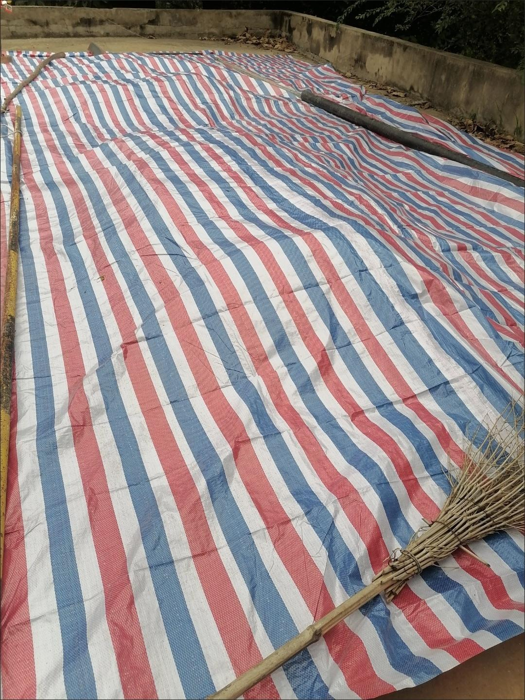

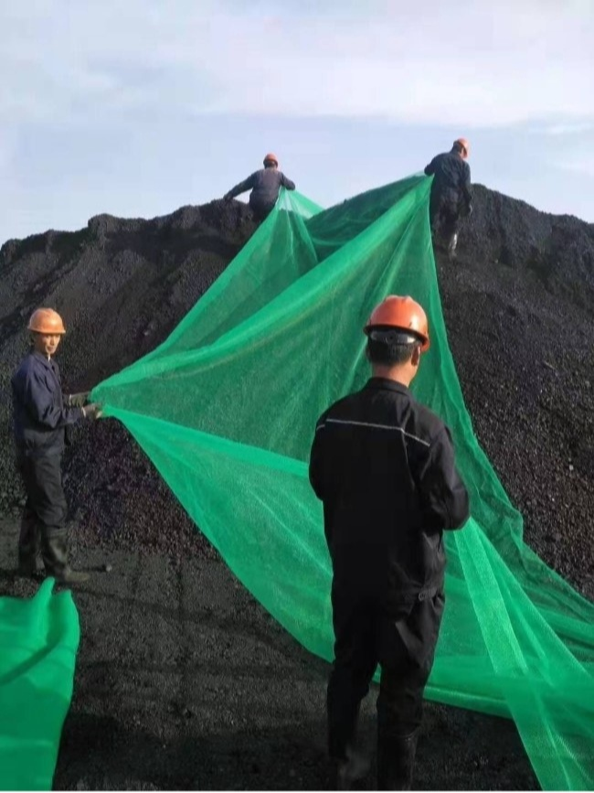
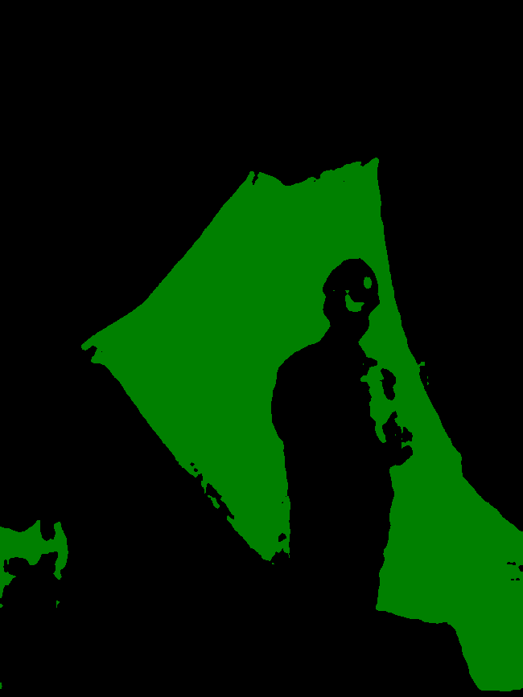
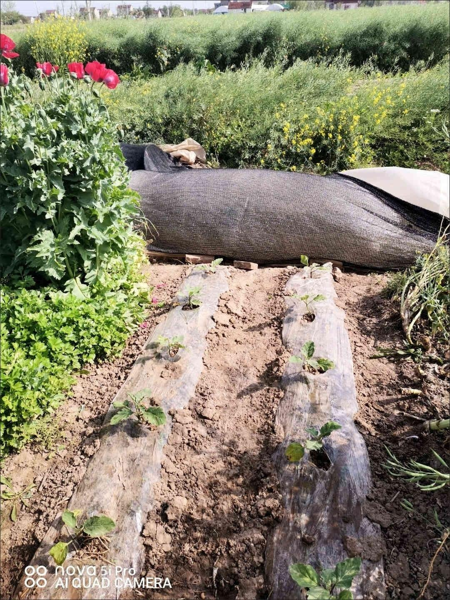
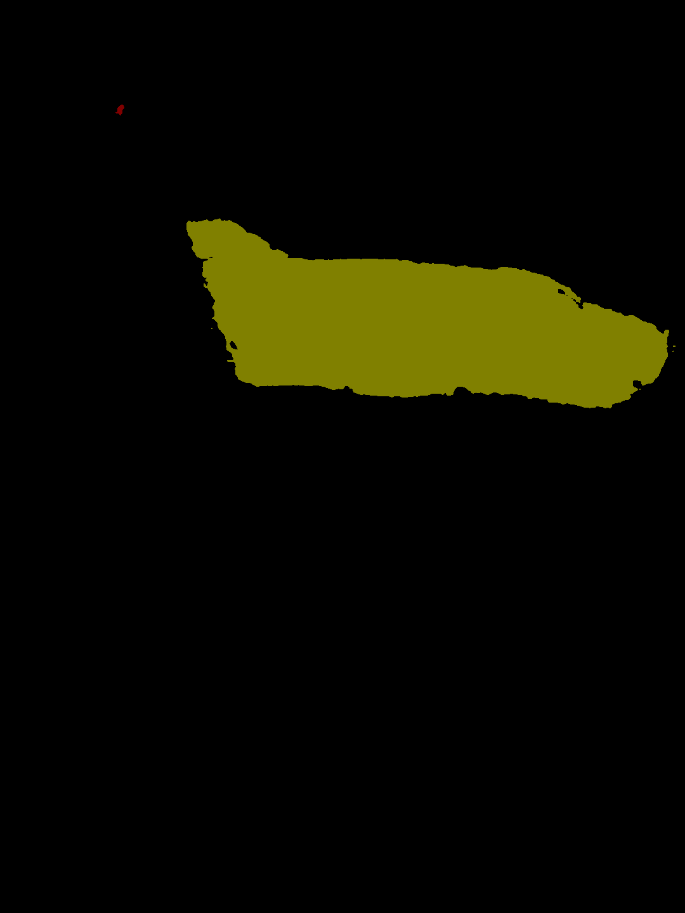
</div>

<div>
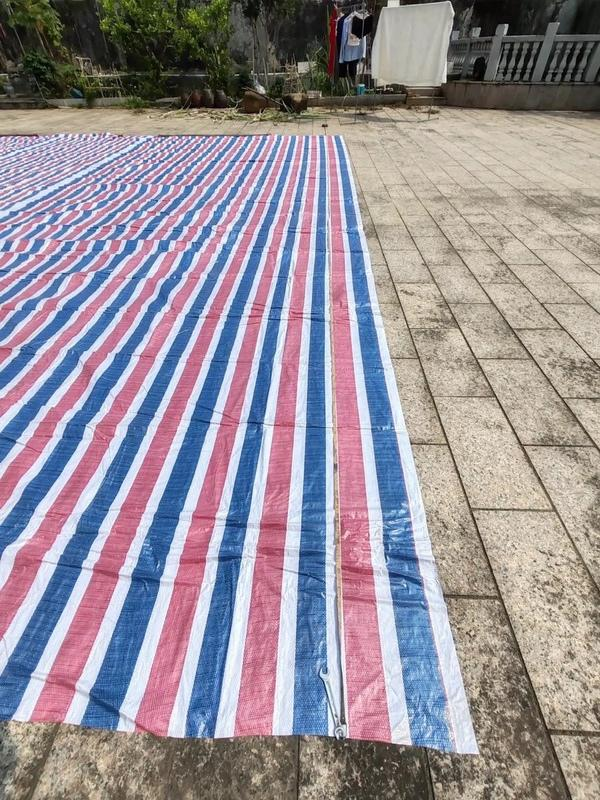

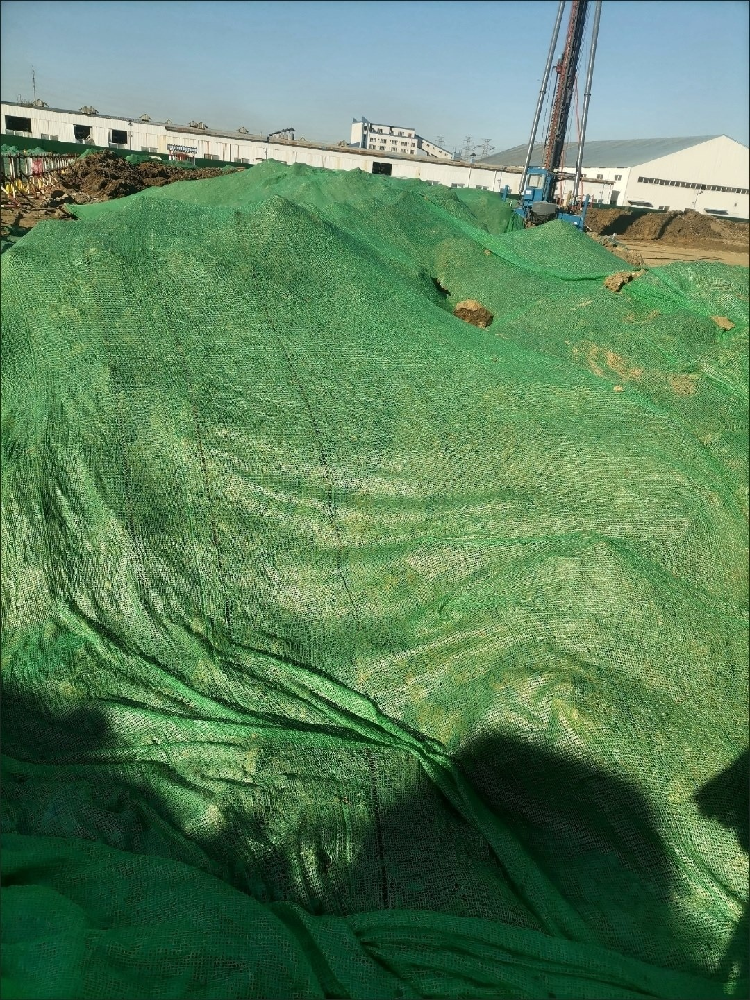

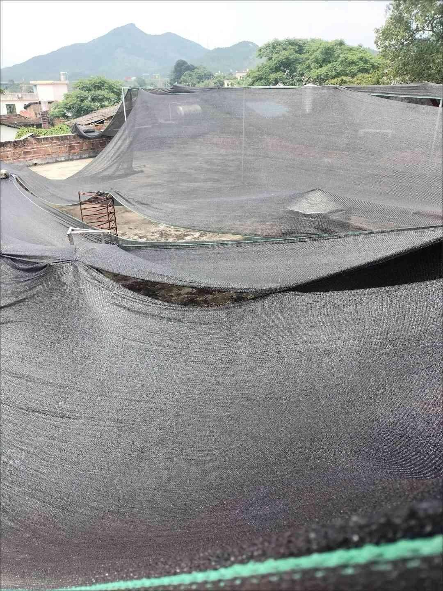

</div>

<div>
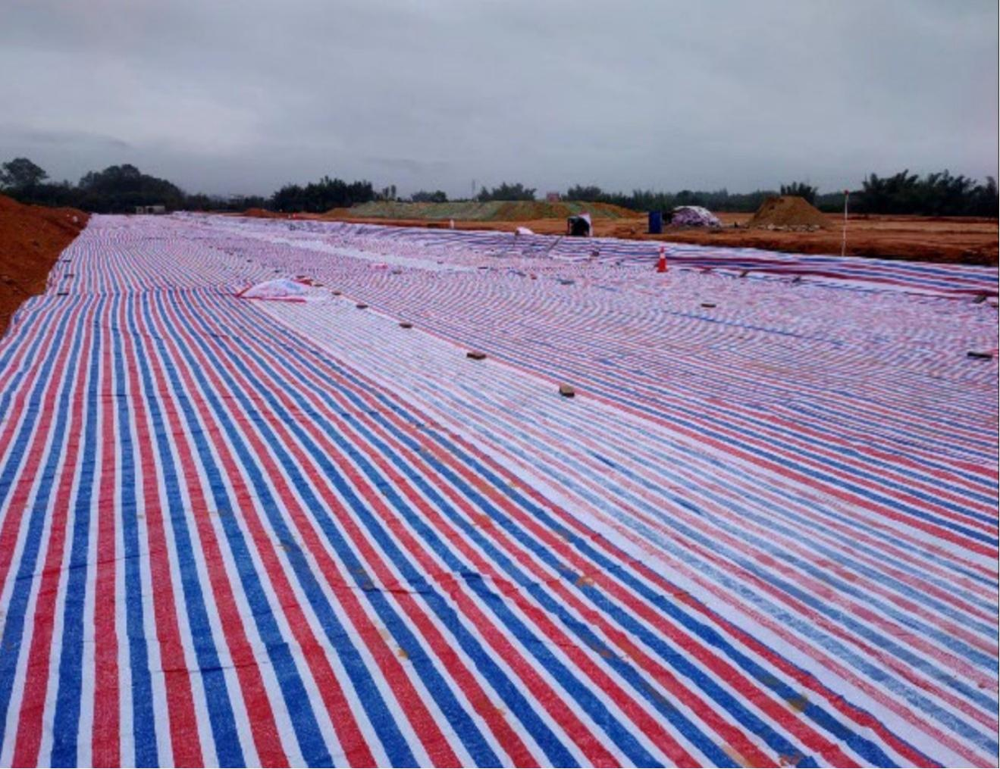

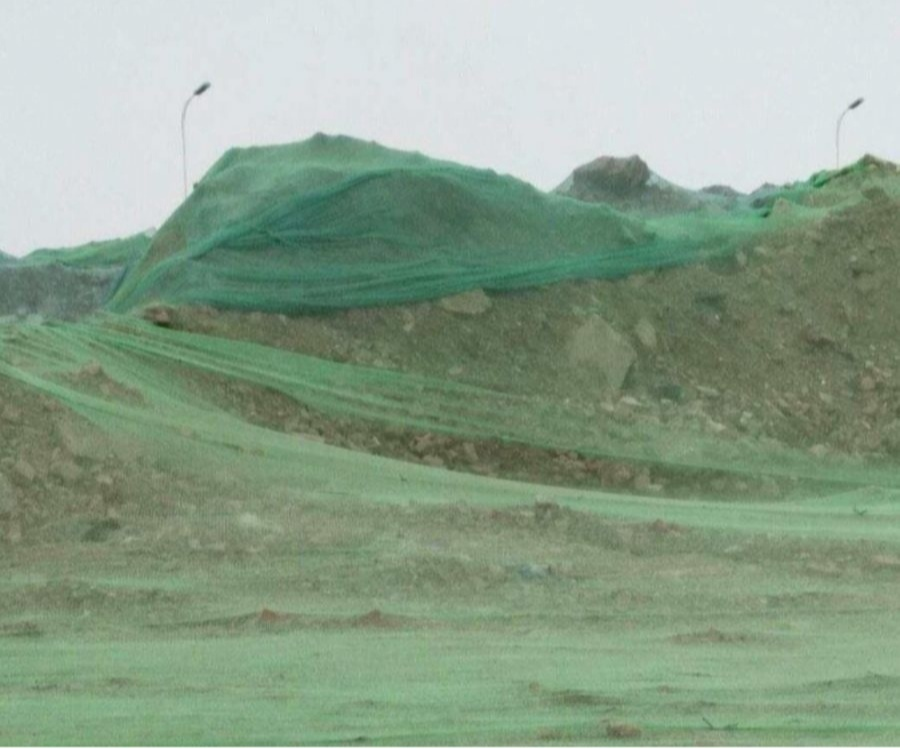

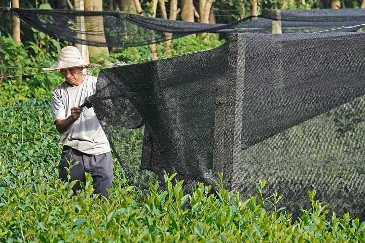
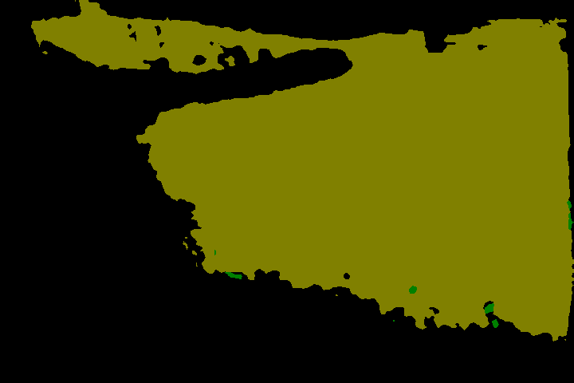
</div>
